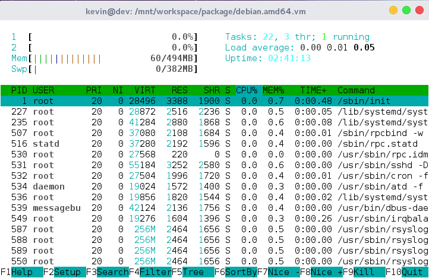

# debian.amd64.vm
virtual machine of debian 8 amd64. that provide an small gnu/linux operating
system for testing

# spec

- emulator: virtual box
- os: debian 8
- number of cpus: 2
- memory: 512MB
- hdd size: 8GB dynamic allocate
- hdd file compress: ~6GB -> ~1.3GB
- static ip: 192.168.1.4
- root user password: root
- dev user password: dev



# installations

## download virtual machine hdd
because hdd is large file, it is imposible to put into git directory. i use
google drive to store it, but they are not provide direct link to download. 
so you must download virtual machine hdd by hand. link to download page here 
[debian.amd64.tar.gz](https://drive.google.com/file/d/0B6Eqm2oY7b1vVUtTa1hUdUpSWGc/view?usp=sharing)

after download completed, i denote path to file is `$vm_hdd_gz_path`. it will
be use to install virtual machine below

## install virtual machine
```shell
# clone source
git clone https://github.com/kevin-leptons/debian.amd64.vm.git
cd debian.amd64.vm.git

# this command will extract hdd file to vms/ directory, create new virtual
# machine with name debian.amd64
./vmctl.sh install $vm_hdd_gz_path

# start virtual machine
# it can take few minutes in first start
./vmctl.sh start

# make sure that virtual machine start 
# and os boot into login screen
./vmctl display

# then you can close display screen 
# and remote by ssh
./vmctl ssh

# save virtual machine when work done
./vmctl.sh save
```

# commands
```shell
./vmct install hdd-path | start | display | ssh | save | compress | remove
```
